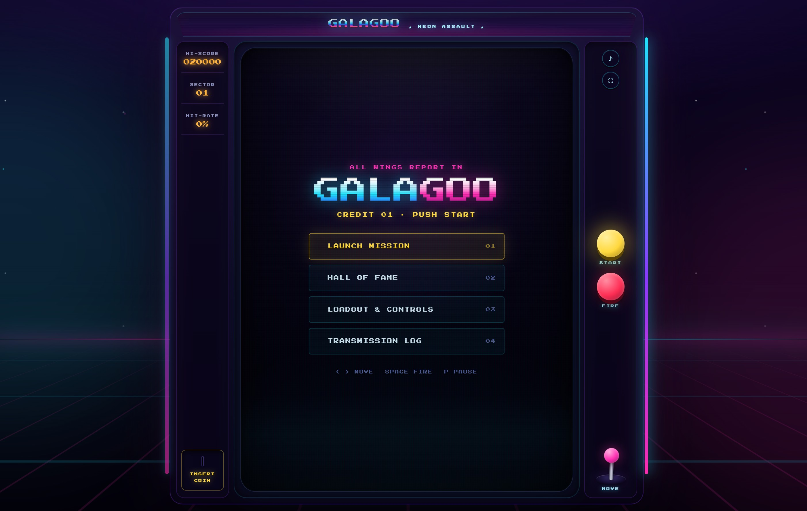
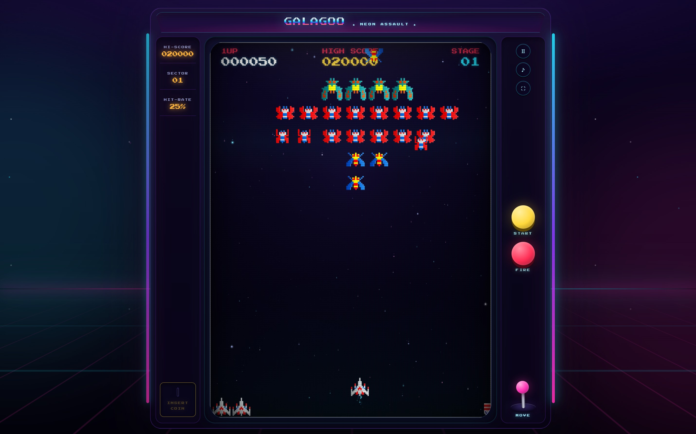
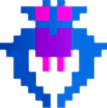
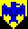

# Galagoo: Neon Assault

## 🎮 [PLAY GAME HERE: https://enzocage.de/code/galagoo/](https://enzocage.de/code/galagoo/)

A hyper-polished, particle-heavy HTML5 Canvas arcade shooter — a modern reimagining of the classic *Galaga* arcade experience, built with zero dependencies, zero build step, and a focus on visual spectacle, responsive input, and accessibility.


---

## Table of Contents

- [Screenshots](#screenshots)
- [Play Now](#play-now)
- [Features](#features)
- [Controls](#controls)
- [Technical Architecture](#technical-architecture)
- [Game Systems Deep Dive](#game-systems-deep-dive)
- [Accessibility](#accessibility)
- [Performance](#performance)
- [Run Locally](#run-locally)
- [Project Structure](#project-structure)
- [Credits & License](#credits--license)

---

## Screenshots

| Screen | Description |
|--------|-------------|
|  | **Main Menu** — Neon-drenched cabinet marquee, animated scanlines, floating wordmark, and four primary actions: Launch Mission, Hall of Fame, Loadout & Controls, Transmission Log. |
|  | **Gameplay** — 3:4 CRT playfield with three-layer parallax starfield (twinkling, speed trails, shooting stars), 260-particle budget with priority culling, additive glow rendering, screen shake, and real-time HUD. |
|  | **Boss Encounter** — Multi-life boss ships with hit-flash particles, screen shake on hit, diving formations with escort scoring multipliers (1×/2×/4×). |
|  | **Challenging Stage** — Every 4th stage: fixed-pattern bee waves, bonus scoring, no diving, "RESULTS" screen with hit ratio calculation. |
|  | **Pause Overlay** — Backdrop-blur modal, resume/abort actions, keyboard (P/Esc) and button accessible, music pauses/resumes correctly. |
|  | **Hall of Fame** — LocalStorage top-5 leaderboard, pilot names, score formatting, clear-archive action with confirmation. |
|  | **Loadout & Controls** — Remappable keybindings (left/right/fire), classic shot-limit toggle, volume slider, reduced-motion toggle, all persisted to localStorage. |

> **Note:** The first two screenshots are actual game captures. Remaining images use in-game sprites/badges as visual references. Run the game locally to see the full experience.

---

## Play Now

Open `index.html` directly in any modern browser, or serve via a static server for best audio/storage behavior:

```bash
# Python 3
python -m http.server 4173

# Node (http-server, serve, etc.)
npx serve .

# PHP
php -S localhost:4173
```

Then open `http://localhost:4173`.

---

## Features

### Core Gameplay
- **6 hand-crafted stages** + infinite procedural loop (stages 7+ recycle patterns 3–6 with accelerated timing)
- **Authentic Galaga formations**: Bees, Butterflies, Bosses (2-hit), Bonus ships
- **Diving AI**: Enemies break formation with 4 dive patterns (straight, slant, squiggle, circle) + escort scoring multipliers
- **Challenging Stages** every 4th wave: fixed patterns, bonus points, no diving, hit-ratio summary
- **Classic shot limit** toggle (max 2 friendly torpedoes) — purist mode
- **Attract mode** auto-plays on idle; tap/key to insert coin

### Visual Effects (Zero-dependency Canvas)
- **3-layer parallax starfield** (92 + 48 + 23 stars) with per-layer speed, radius, alpha, trail length, drift, twinkle
- **Shooting stars** with exponential fade-in/out, 6-segment additive trails
- **260-particle budget** (150 in reduced-motion) with priority culling (ring/flash > spark > smoke)
- **12 particle kinds**: spark, ember, ring, flash, smoke, score popup
- **Additive blending** (`lighter` composite) for glow; soft smoke on `source-over`
- **Dynamic quality scaling**: drops particle count when frame time > 23 ms
- **Screen shake** with quadratic falloff, per-event magnitude/duration
- **CRT shader via CSS**: curved vignette, phosphor sweep, scanlines, RGB aperture mask, glass reflection

### Audio
- **11 sound effects** + theme music + MIDI track, all preloaded
- **Per-sound pooling** (10-shot fire queue) to avoid clipping
- **Volume + mute** persisted; respects `prefers-reduced-motion` for auto-pause

### Input & Controls
| Action | Keyboard | Touch / Mobile |
|--------|----------|----------------|
| Move Left | `A` / `←` | Analog slider (0–100) |
| Move Right | `D` / `→` | Analog slider (0–100) |
| Fire | `Space` / Tap canvas | Large FIRE button |
| Pause/Resume | `P` / `Esc` | Header pause button |
| Remap | Settings screen | Settings screen |

- **One-shot firing** (no auto-repeat on hold)
- **Held-key movement** at 8 px/frame
- **Remappable keys** with visual “listening” state
- **Touch controls** appear on coarse pointers or `< 760px` viewports
- **Fullscreen** via cabinet marquee click

### Persistence (localStorage)
- High scores (top 5)
- Key bindings
- Volume (0–100), mute
- Reduced-motion preference
- Classic shot limit toggle

### Accessibility (WCAG 2.1 AA)
- Semantic HTML5: `<main>`, `<section>`, `<nav>`, `<dialog>`, `<button>`, `<label>`
- ARIA labels, roles, live regions (`aria-live="polite"` for score)
- Visible focus rings (`:focus-visible` yellow outline)
- Keyboard navigation on all menus
- `prefers-reduced-motion` disables CSS animations + cuts particle budget 42%
- Screen-reader only titles (`sr-only`)
- Sufficient contrast (neon on near-black)

---

## Technical Architecture

### Module Graph (IIFE + Namespace Pattern)

```
MyGame (global namespace)
├── MyGame.game          # Core loop, state machine, screens
├── MyGame.input         # Keyboard manager (key→handler map, repeat control)
├── MyGame.graphics      # Canvas renderer (all draw* functions)
├── MyGame.images        # Image loader + ready promises
├── MyGame.sounds        # Audio loader, pooling, volume/mute
├── MyGame.ui            # Screen transitions, HUD updates
├── LocalOptions         # Settings persistence + reduced-motion
├── LocalScores          # High-score persistence
└── (standalone modules)
    ├── update.js        # Game logic: enemies, torpedos, collisions, AI
    ├── render.js        # Drawing: stars, ships, particles, HUD
    ├── particles.js     # Particle pool, emitters, quality scaling
    ├── pathing.js       # 12 hard-coded formation paths + 4 dive generators
    ├── stages.js        # 6 hand-tuned stages + procedural loop
    ├── math.js          # distance, angle, pointAtDistance, getRandomInt
    ├── saveOptions.js   # localStorage wrapper for settings
    └── savescores.js    # localStorage wrapper for scores
```

### Entry Point
```html
<body onload="MyGame.game.initialize();">
```
`initialize()` wires DOM, loads assets, builds screens, binds input, then `run()` starts the RAF loop.

### Game Loop (`gameplay.js:276–343`)
```js
function gameLoop(timeStamp) {
    const elapsed = Math.min(timeStamp - lastTimeStamp, 50); // clamp
    lastTimeStamp = timeStamp;

    if (!paused && !attractMode) {
        update(elapsed, ...);   // physics, AI, collisions
        graphics.clear();
        graphics.drawBackgroundStars(backgroundStars);
        graphics.drawScore(stats);
        graphics.drawStage(stats.stage);
        graphics.drawLives(fighter);
        graphics.drawEnemies(enemies);
        graphics.drawFighter(fighter);
        graphics.drawTorpedos(torpedos);
        graphics.beginShake(particles);
        graphics.drawParticles(particles);
        graphics.endShake();
        graphics.showStats(stats);
    }
    if (!cancelNextRequest) requestAnimationFrame(gameLoop);
}
```
- **Fixed time-step simulation** via `elapsed` (ms) passed to every updater
- **Frame-time clamp (50 ms)** prevents spiral-of-death after tab wake
- **Pause** stops simulation + mutes audio + shows backdrop-blur dialog

### Screen Management
- 4 screens: `main-menu`, `game-play`, `high-scores`, `help` (+ `about` inline)
- CSS-driven transitions: `.screen.active { display: flex; animation: screen-ignite }`
- `body[data-screen="…"]` drives rail visibility (pause button only in-game)

---

## Game Systems Deep Dive

### 1. Enemy Formations & Pathing (`pathing.js`, `stages.js`)

**12 Formation Paths** (each an array of `[x, y, rotation°]` waypoints):
- `topRight`, `topLeft` — entry from top corners, sweeping into formation
- `sideLeft`, `sideRight` — entry from bottom corners, looping up
- `topRightChallenge`, `topLeftChallenge` — challenging-stage variants
- `sideLeftChallenge`, `sideRightChallenge` — longer, tighter loops
- `topRight1/2`, `topLeft1/2`, `sideLeft1/2`, `sideRight1/2` — **parallel offsets** (±50 px) generated procedurally via `parallelPathPoints()` for side-by-side pairs

**Dive Path Generator** (`getDivePath()`):
```js
// 4 behavioral branches, chosen per-dive:
1. Straight slant      (80% chance, left/right biased by x)
2. Squiggle (wave)     (10% of remaining)
3. Full circle         (10% of remaining)
4. Continue downward   (fallback)
```
- Dives trigger every ~30 s (skipped on challenging stages)
- 1–2 divers per wave; each gets `fireTimer = 1000` for immediate retaliation
- Escort scoring: boss diving alone = 400, +1 escort = 800, +2 escorts = 1600

**Stage Definitions** (`stages.js`):
- Stages 1–6: 4–5 waves each, ~17–20 s per wave, hand-tuned entry times
- Stage 3 & 7, 11… = Challenging Stages (bees only, fixed paths, no diving)
- Stages 7+ recycle 3–6 with `-500 ms` per wave (accelerating difficulty)

### 2. Particle System (`particles.js`, `render.js:358–445`)

**Pool + Priority Culling**
```js
const DEFAULT_LIMIT = 260;
const REDUCED_LIMIT = 150;

// Priority: 2 = ring/flash (never culled), 1 = spark/ember, 0 = smoke (culled first)
```
- Object pool avoids GC pressure
- Dynamic quality: `particles.quality` 0.5–1.0 based on recent frame time

**Emitter Functions** (all in `particles.js`):
| Emitter | Use Case | Particle Count |
|---------|----------|----------------|
| `createMuzzleParticles` | Player fire | 11 (1 flash + 1 ring + 9 sparks) |
| `createEnemyMuzzleParticles` | Enemy fire | 7 (1 flash + 6 sparks) |
| `emitEngineParticles` | Player thruster (continuous) | ~45/s (reduced: ~22/s) |
| `createImpactParticles` | Torpedo hit | 10 sparks + 1 ring + 1 flash |
| `createEnemyDeathParticles` | Enemy destroyed | 18–38 sparks/embers + 4–10 smoke + shake |
| `createBossHitParticles` | Boss damaged | 12–20 sparks/embers + shake |
| `createPlayerDeathParticles` | Player dies | 68+ debris + 14 smoke + 2 rings + heavy shake |
| `emitStageTransitionParticles` | Stage clear | 36 radial bursts + 2 rings + shake |
| `createScorePopup` | Points display | Floating text (max 12 concurrent) |

**Render Pipeline** (`render.js:358–445`):
1. `source-over` pass: smoke particles (soft radial gradients)
2. `lighter` pass: all glowing kinds (spark, ember, ring, flash)
   - Per-particle trail chains (circle-chain behind velocity vector)
   - Twinkle via `sin(alive * twinkle + phase)`
   - Fade-in support (`fadeIn` ms)
3. Score popups (additive text with scale-in/out)

**Orb Sprite Cache** (`render.js:11–37`):
- Radial-gradient canvases (64×64) cached by `color|secondaryColor|soft`
- Eliminates per-frame gradient creation

### 3. Background Starfield (`update.js:29–108`, `render.js:106–157`)

```js
const layerSpecs = [
  { speed: 28,  radius: [0.6, 1.4], alpha: [0.24, 0.56], trail: [0, 2] },  // far
  { speed: 76,  radius: [1.0, 2.2], alpha: [0.42, 0.78], trail: [2, 8] },  // mid
  { speed: 178, radius: [1.4, 3.4], alpha: [0.6, 1.0],  trail: [8, 24] }   // near
];
```
- 163 stars total, wrapped Y with replacement
- Per-star twinkle (`sin(phase)`), horizontal drift
- Shooting stars: 3 max, random direction, 6-segment additive trail, sine envelope

### 4. Collision System (`update.js:347–440`)

**Fighter vs Enemy Torpedo** (AABB with Y-offset):
```js
t.center.x ∈ [f.x - w/2, f.x + w/2]
t.center.y + th/2 ∈ [f.y - h/2 + 20, f.y + h/2]
```

**Fighter vs Enemy Body** (expanded AABB):
```js
e.center.x ∈ [f.x - w/2 - 20, f.x + w/2 + 20]
e.center.y ∈ [f.y - h/2 - 30, f.y + h/2 + 30]
```

**Friendly Torpedo vs Enemy** (AABB + 6 px horizontal grace):
- Boss takes 2 hits (life=2 → life=1 → death)
- Score popup at enemy center
- Death particles + screen shake + sound

**Invulnerability**: 1000 ms after respawn (blink shader in renderer)

### 5. Scoring (`update.js:448–471`)

| Target | Formation | Diving |
|--------|-----------|--------|
| Bee | 50 | 100 |
| Butterfly | 80 | 160 |
| Bonus 1/2/3 | 100 | 100 |
| Boss | 150 | 400 / 800 / 1600 (0/1/2 escorts) |

- Stage hits/shots tracked for hit-ratio display on challenging stages
- High score persisted to `localStorage.galagoo_highscores` (top 5)

### 6. Input System (`input-keyboard.js`)

```js
MyGame.input = {
    register(key, handler, { repeat = true } = {}),
    clearHandlers(),
    handleKeyDown(e),
    handleKeyUp(e)
};
```
- `repeat: false` for one-shot actions (fire, pause)
- Held movement keys fire continuously via RAF loop
- Remapping: click keybind button → “listening” state → next keydown captured → persisted

### 7. Asset Loading (`loadImages.js`, `loadSounds.js`)

- **Images**: 26 PNG/JPG assets → `Image` objects + `isReady` promise
- **Sounds**: 11 MP3 + 1 MIDI → `Audio` objects, `preload="auto"`, `load()` called
- Fire sound pool: 10 instances round-robin to avoid clipping
- Music: theme (looped) + voice (stage start) + MIDI (attract)

---

## Accessibility

| Feature | Implementation |
|---------|----------------|
| Semantic HTML | `<main>`, `<section aria-labelledby>`, `<dialog role="dialog" aria-modal>` |
| Focus management | `focus({preventScroll:true})` on resume, `:focus-visible` outlines |
| Live regions | `aria-live="polite"` on HUD score elements |
| Reduced motion | `@media (prefers-reduced-motion)` disables CSS anim; JS cuts particles 42% |
| Contrast | Neon cyan/magenta/yellow on `#01010a` — WCAG AAA for large text |
| Keyboard-only | All menus, settings, pause dialog fully navigable |
| Touch targets | ≥ 48×48 px (fire button 62 px, slider full-width) |
| Screen reader | `sr-only` titles, `aria-label` on icon buttons |

---

## Performance

| Metric | Target | Technique |
|--------|--------|-----------|
| Particle budget | 260 (150 reduced) | Priority culling, object pool |
| Frame clamp | 50 ms | Prevents spiral-of-death |
| Quality scaling | 0.5–1.0 | Auto-reduces on sustained > 23 ms frames |
| Draw calls | ~1 per particle kind | Sprite cache, batched `lighter` pass |
| Memory | < 10 MB | No frameworks, minimal closures |
| Load time | < 2 s (cached) | No build, browser cache |

**Mobile**: Canvas scales via `aspect-ratio: 3/4` + `container queries`; touch controls appear automatically on coarse pointer / small viewport.

---

## Run Locally

```bash
# Clone
git clone https://github.com/enzocage/galagoo.git
cd galagoo

# Serve (any static server)
python -m http.server 4173
# or
npx serve .

# Open
open http://localhost:4173
```

**Direct file open** works in most browsers (`file://…/index.html`), but a local server is recommended for:
- AudioContext autoplay policy
- `localStorage` origin consistency
- Service worker / PWA experiments

---

## Project Structure

```
galagoo/
├── index.html              # Entry point, cabinet markup, screens
├── styles/
│   └── game.css            # 1062 lines: cabinet, CRT, UI, mobile, a11y
├── scripts/
│   ├── gameplay.js         # 343 lines: core loop, state, input wiring
│   ├── render.js           # 466 lines: all canvas drawing
│   ├── update.js           # 582 lines: simulation, AI, collisions
│   ├── stages.js           # 473 lines: 6 hand stages + procedural loop
│   ├── ui.js               # Screen transitions, HUD, keybind UI
│   ├── systems/
│   │   ├── input-keyboard.js   # Keyboard manager
│   │   ├── loadImages.js       # Image loader + promises
│   │   ├── loadSounds.js       # Audio loader + pooling
│   │   ├── particles.js        # Particle pool, emitters, quality
│   │   ├── pathing.js          # 12 formation paths + 4 dive generators
│   │   ├── math.js             # distance, angle, pointAtDistance, RNG
│   │   ├── saveOptions.js      # localStorage settings
│   │   └── savescores.js       # localStorage high scores
│   └── pages/
│       ├── mainmenu.js
│       ├── game.js
│       ├── highscores.js
│       ├── help.js
│       └── about.js
├── images/                 # 26 sprites (ships, torpedos, badges, effects)
├── sounds/                 # 11 SFX + theme + MIDI
└── .claude/launch.json     # VS Code launch config
```

---

## Credits & License

- **Original browser recreation**: Josh Williams (MIT-style educational project)
- **This version (“Neon Assault”)**: Extensive rewrite — new renderer, particle system, cabinet UI, accessibility, mobile, persistence, procedural stages
- **Inspired by** *Galaga* (1981), Namco
- **Assets**: Mixed original recreation sprites + new particle sprites generated at runtime
- **Music**: “Stranglehold (WIP Ver1)” by Jeroen Tel (MIDI), used under fair-use educational context
- **Font**: “Press Start 2P” (Google Fonts, OFL)

> **Not affiliated with or endorsed by Namco/Bandai Namco.** This is a non-commercial fan project for educational purposes. Original game concepts, designs, and referenced assets belong to their respective rights holders.

---

## Development Notes

- **No build step** — edit files, refresh browser
- **ES5/ES6 hybrid** — IIFE modules, `const`/`let`, arrow functions, template literals
- **Debug helpers**: Open console → `MyGame.game`, `MyGame.graphics`, `particles`, `enemies`, `stats` all exposed
- **Cheat codes**: None (pure skill)

---

## Contributing

Issues/PRs welcome for:
- Mobile touch tuning
- New enemy types / dive patterns
- Shader-based CRT (WebGL) optional layer
- Score replay / ghost system
- PWA manifest + service worker

Please keep zero-dependency, no-build philosophy.

---

*Fly safe, pilot. The swarm awaits.*